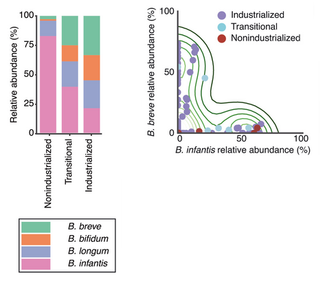
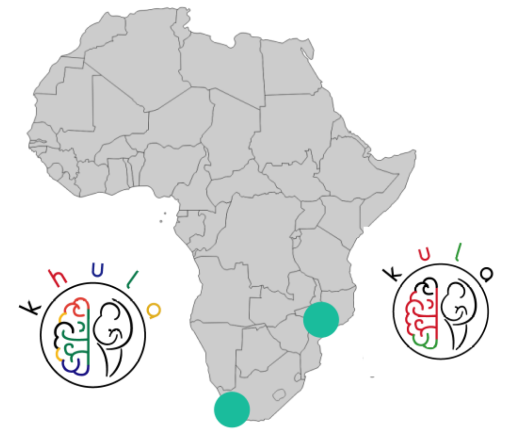
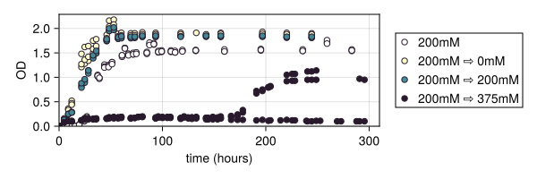
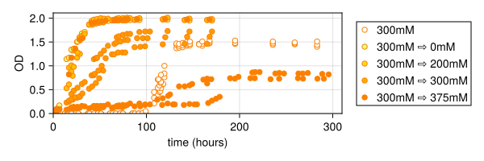
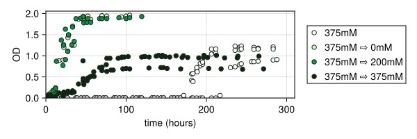

<!-- Title slide: swap logo size, talk title, presenter, and date for your own talk.
Presenter/date/venue text comes from footer-info.ts (shared with global-bottom.vue's
running footer) — edit that one file to update both. -->

<script setup lang="ts">
import { footerInfo } from './footer-info'
</script>

<LabLogo size="7rem" class="mx-auto mb-8" />

# Talk title goes here

<div class="mt-8 font-mono text-sm text-ink-muted">
{{ footerInfo.author }} · {{ footerInfo.date }}
</div>

---

# Agenda

<Toc minDepth="1" maxDepth="1" />

---
layout: section
---

# Section title

Use the `section` layout to break a talk into parts.

---

# Background

- Point one
- Point two
- Point three

```julia
function greet(name::String)
    return "Hello $name!" 

println(greet("lab"))
```

<!--
Code blocks render with the lab's Kanagawa syntax theme (light: kanagawa-lotus, dark: kanagawa-wave).
-->
---

# Figure & Citation Examples

Three layout patterns (full image / full bullets / two-column), an animated
figure reveal, and citations with an auto-generated bibliography.

See `CLAUDE.md` for the image/citation conventions this reference follows.

---
layout: center
---

<!--
Layout 1: full slide image. `layout: center` + a height-capped `` — simpler
and more predictable than `layout: image`'s CSS background-image, since the
citation caption below is bottom-aligned to the content area and would
otherwise collide with whatever the image renders at its bottom edge.
-->



<ProseCite bref="olmRobustVariationInfant2022" />

---

<!-- Layout 2: full slide bullets — plain content slide -->

# Key takeaways

<v-clicks>

- *B. infantis* is a hallmark of non-industrialized infant microbiomes
- It's largely absent from industrialized infant guts — breastfed or not
- Open question: what's driving the decline?

</v-clicks>

---
layout: two-cols
layoutClass: gap-8
---

<!-- Layout 3: two-column — bullets on one side, figure on the other via `::right::` -->

# The Khula cohort

- Multi-site child development cohort across South Africa and Malawi
- Tracks executive function alongside microbiome and EEG data
- One of few child-development cohorts outside industrialized contexts

<ProseCite bref="zieffCharacterizingDevelopingExecutive2024" />

::right::



---
layout: two-cols-header
layoutClass: gap-8 items-center
---

# *B. infantis* responds to salt after a long lag

::left::

<!-- Bullets and figure reveal in step together via matching click numbers -->
<v-clicks>

- No response at low salt (200 mM)
- A visible lag appears at moderate salt (300 mM)
- The lag grows substantially at high salt (375 mM)

</v-clicks>

::right::

<!-- max-h caps each image so 3 stacked always fit above the footer, same
convention as the Layout 1 slide's max-h-[70vh] mx-auto — cap height, let
width auto-scale, instead of w-full's uncapped aspect-ratio height. -->
<div class="flex flex-col gap-1 items-center">



</div>

::bottom::

<div class="citation-caption">Bonham Lab, unpublished</div>

---

# HTML/CSS cheatsheet: images & text

<!--
Reference slides for whoever's editing this deck — not meant to survive into
an actual talk. Classes below are UnoCSS utilities (Tailwind-compatible
syntax, via presetWind3 — see @slidev/client/uno.config.ts) merged with
@bonhamlab/slidev-template's uno.config.ts theme tokens (primary/accent/
secondary/bg/surface/border/ink/ink-muted, see that repo's uno.config.ts).
-->

Classes already used in this deck:

- `w-full` — image fills its container's width (salt-response slide's stacked figures)
- `max-h-[70vh] mx-auto` — caps height so a full-bleed image never overflows the slide; `mx-auto` re-centers it horizontally since it's no longer full-width (Layout 1 slide)
- `rounded-md` / `border border-border` — corner radius / a theme-colored border (Khula slide's figure)
- `text-center` — centers text *within its own box*; doesn't reposition the box itself (`layout: center` positions the whole block; `class: text-center` aligns the text inside it — two different jobs, both needed on the title/thank-you slides)
- `text-sm text-ink-muted font-mono` — small muted mono text, used for byline/footer-style text (title slide)
- `mt-8` / `mb-6` / `gap-2` — spacing, Tailwind's rem-based scale (`mt-8` = 2rem, `gap-2` = 0.5rem)

Full utility reference: [UnoCSS interactive docs](https://unocss.dev/interactive/) · [Tailwind CSS docs](https://tailwindcss.com/docs) (same class names — UnoCSS's `presetWind3` mirrors Tailwind's syntax)

---

# HTML/CSS cheatsheet: structure & animation

- Wrap in a `<div>` when grouping *multiple* elements into one flex/grid item (e.g. the salt-response slide's stacked images: `<div class="flex flex-col gap-2 ...">`), or an absolutely-positioned block (`.citation-caption`)
- Don't wrap a single element, or a Vue component that already renders its own container — `<v-clicks>` compiles a real `<ul>`, so a `<div>` around it just adds dead markup
- `<v-clicks>` — reveals a whole list item-by-item automatically
- `v-click="2"` on one specific element — reveals just that element on click #2, for matching a bullet to a figure in step (salt-response slide)
- `::left::` / `::right::` / `::bottom::` — named slots for the `two-cols`/`two-cols-header` layouts — Slidev markdown syntax, not real HTML

More: [Slidev click animations](https://sli.dev/guide/animations) · [Slidev built-in components](https://sli.dev/builtin/components) · [MDN: Flexbox](https://developer.mozilla.org/en-US/docs/Web/CSS/CSS_flexible_box_layout/Basic_concepts_of_flexbox) · [MDN: Grid](https://developer.mozilla.org/en-US/docs/Web/CSS/CSS_grid_layout/Basic_concepts_of_grid_layout)

---
layout: center
class: text-center
---

<LabLogo size="5rem" class="mx-auto mb-6" />

# Thank you

<div class="text-ink-muted">

Questions? Reach out — [bonhamlab.bio](https://bonhamlab.bio) · presenter@bonhamlab.bio

</div>

---
layout: biblio
---

# Bibliography
