<!-- Title slide: swap logo size, talk title, presenter, and date for your own talk.
Presenter/date/venue text comes from footer-info.ts (shared with global-bottom.vue's
running footer) — edit that one file to update both. -->

<script setup lang="ts">
import { footerInfo } from './footer-info'
</script>

<LabLogo size="7rem" class="mx-auto mb-8" />

# The state of BioJulia

<div class="mt-8 font-mono text-sm text-ink-muted">
{{ footerInfo.author }} · {{ footerInfo.date }}
</div>

---

# Agenda

<Toc minDepth="1" maxDepth="1" />

---
layout: section
---

# Computing in Biology

A very brief history

---

# Biology and computing has a rich history

<v-clicks>

- 1965 — Dayhoff's Atlas of Protein Sequence and Structure
- 1970 — Needleman–Wunsch global alignment
- 1971 — Protein Data Bank founded at Brookhaven 
- 1975 — Levitt & Warshel, first computer simulation of protein folding
- 1977 — McCammon, Gelin & Karplus, first molecular dynamics simulation of a protein, BPTI; Karplus/Levitt/Warshel shared the 2013 Nobel.
- 1978 — Dayhoff PAM substitution matrices.
- 1981 — Smith–Waterman local alignment.
- 1990 — BLAST.
- 1994 — Burrows–Wheeler Transform
- 1995 — First complete bacterial genome (H. influenzae, TIGR).
- 2000–2003 — Human Genome Project draft/completion.
- 2001 — Pevzner et al. de Bruijn / Eulerian-path formulation of fragment assembly.
- 2020 — AlphaFold2 wins CASP14 (Nov/Dec 2020), near-experimental accuracy.
- 2021 — AlphaFold2 Nature paper + open-source release (July 2021); AlphaFold DB (200M+ structures).

</v-clicks>

---
layout: section
---

# History of BioJulia

est. 2014

---

# First commit - Bio.jl c. 2015

## Early Contributors:

<div class="grid grid-cols-3 gap-2 justify-items-center">
<div class="flex flex-col items-center gap-1">

<span class="text-sm font-mono">@blahah</span>
</div>
<div class="flex flex-col items-center gap-1">

<span class="text-sm font-mono">@bicycle1885</span>
</div>
<div class="flex flex-col items-center gap-1">

<span class="text-sm font-mono">@dcjones</span>
</div>
<div class="flex flex-col items-center gap-1">

<span class="text-sm font-mono">@kdm9</span>
</div>
<div class="flex flex-col items-center gap-1">
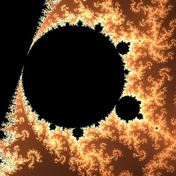
<span class="text-sm font-mono">@jgreener64</span>
</div>
<div class="flex flex-col items-center gap-1">

<span class="text-sm font-mono">@transgirlcodes</span>
</div>
</div>

---
layout: two-cols-header
layoutClass: gap-8 items-center !grid-cols-[3fr_1fr]
---


# Parsing infrastructure

::left::

<!-- Bullets and figure reveal in step together via matching click numbers -->
<v-clicks>

- May 2015 - `@dcjones` introduces Ragel for fast / accurate parsing
- Jan 2016 - `@bicycle1885` replaces Ragel with all-julia state machine generator (`Automa.jl`)
- Sep 2023 - `@jakobnissen` releases `Automa.jl` v1.0


</v-clicks>

::right::

<!-- max-h caps each image so 3 stacked always fit above the footer, same
convention as the Layout 1 slide's max-h-[70vh] mx-auto — cap height, let
width auto-scale, instead of w-full's uncapped aspect-ratio height. -->
<div class="flex flex-col gap-1 items-center">


</div>

---
layout: two-cols-header
layoutClass: gap-8 items-center !grid-cols-[3fr_1fr]
---

# Infrastructure / Other

::left::

<v-clicks>

- April 2016 - `@kescobo`'s first contribution to `Bio.jl` (added a wrapper for BLAST search - now `NCBIBlast.jl`)
- May 2017 - Decomposition of Monorepo (eg. `Bio.Seq` becomes BioSequences.jl - driven by `@bicycle1885` and `@transgirlcodes`)
- Dec 2018 - Transition from REQUIRE to Project.toml
- Feb 2019 - May 2020 - Use of BioJulia Registry 
- May 2020 - `Bio.jl` officially deprecated / archived
</v-clicks>

::right::

<div class="flex flex-col gap-1 items-center">


</div>

---
layout: section
---

# BioJulia in 2026

---

# Most stared repos

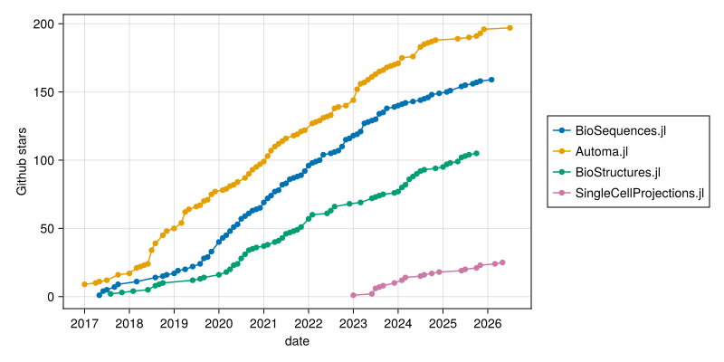

---

# Repo statistics

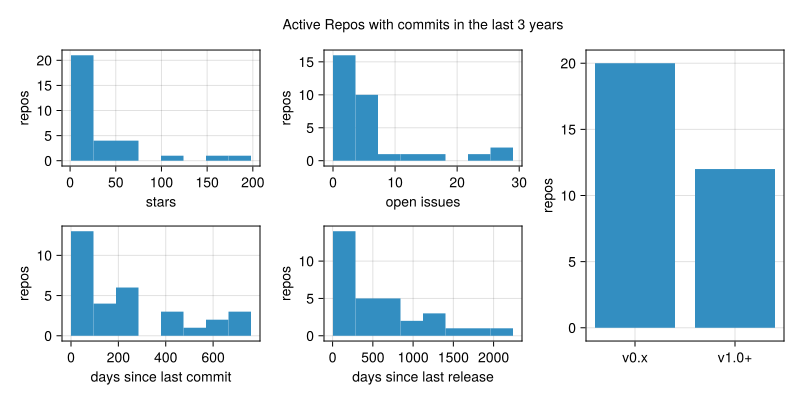

---

# Contributor statistics

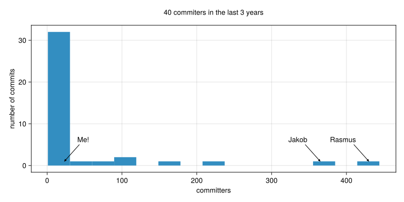

---
layout: section
---

# Highlights and growth areas

---

# BioSequences.jl efficiently encodes biological sequences

```julia {|4,7|5,8}
import Base: summarysize
using BioSequences, Random

seq = randseq(DNAAlphabet{2}(), 512);
str = String(seq);

summarysize(seq) # 184
summarysize(str) # 520
```

<div v-click>

```julia
help?> DNAAlphabet{2}
  DNA nucleotide alphabet.

  DNAAlphabet has a parameter N which is a number that determines
  the BitsPerSymbol trait. Currently supported values of N are 2 and 4.
```

</div>

<div v-click>

```julia
julia> @btime findall(DNA_A, $seq);
  1.487 μs (4 allocations: 1.92 KiB)

julia> @btime findall(==('A'), $str);
  3.093 μs (4 allocations: 1.92 KiB)
```

</div>

---

# BioSequences.jl competes with special-purpose languages

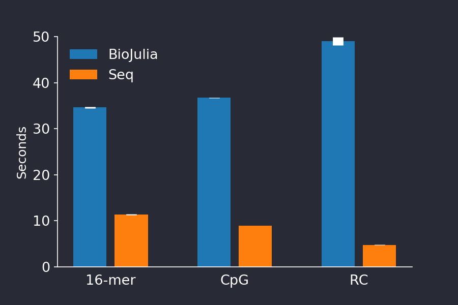
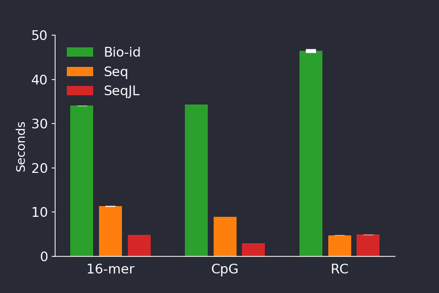

<div class="citation-caption">Seq Language: https://doi.org/10.5281/zenodo.3374036 · Blog post: https://biojulia.dev/posts/seq-lang/</div>

---

# BioSequences.jl competes with special-purpose languages

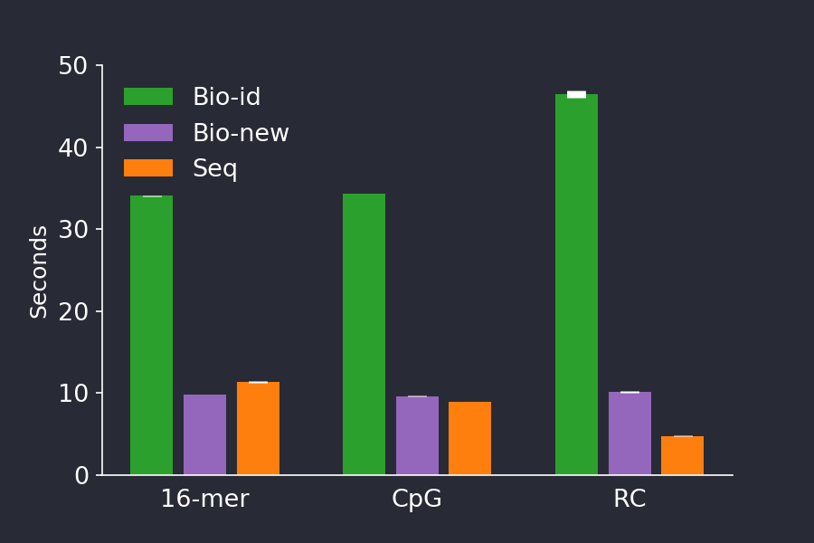

<div class="citation-caption">Seq Language: https://doi.org/10.5281/zenodo.3374036 · Blog post: https://biojulia.dev/posts/seq-lang/</div>

---
layout: two-cols-header
layoutClass: gap-8 !grid-cols-[minmax(0,1fr)_minmax(0,1fr)]
class: text-sm
---

# File parsing is a critical part of bioinformatics

::left::

**FASTA**

```txt
> some header | other info
AATTACGC
> foo
AGGGAGATCCC
```

**FASTQ**

```txt
@ some header | other info
AATTACGC
+
AAAAA#EE
@ foo
AGGGAGATCCC
+
AA#G</EEA6E
```

::right::

**SAM**

```txt
@HD     VN:1.0  SO:unsorted
@SQ     SN:1455__A0A0C2TZA5__A3781_04875        LN:1008
@SQ     SN:1455__A0A0C2XRW0__A3781_18225        LN:804
@SQ     SN:1455__A0A0C2XXQ4__A3781_14565        LN:867
...
VH01194:15:AAAWT2VHV:1:1101:49456:1398:N:0:GAACTGAGCG+CGCTCCACGA#0/1__1.101 16 1134687__A0A378ENW4__cobJ 67 3 150M * 0 0 CTGCAGGCGGCGGAAATCGTCGTCGGTTATAAAACTTACACCCATCTGGTGAAGGCTTTTACCGGCGACAAGCAGGTGATCAAAACCGGGATGTGCAAAGAGATTGAACGCTGTCAGGCGGCGATTGAACTGGCGCAGGCCGGGCACAAC ... AS:i:-59 NM:i:12 YT:Z:UU
```

<div v-click>

> *The development of every bioinformatics tool
> begins with the definition of a new file format,
> incompatible with all previous formats.*
>
> — Charles Darwin

</div>

<style>
.slidev-layout :deep(pre),
.slidev-layout :deep(code) {
  white-space: pre-wrap;
  word-break: break-all;
}
</style>

---
class: text-sm
---

# Automa.jl enables the construction of correct but efficient file parsers

Automa makes Deterministic Finite Automata

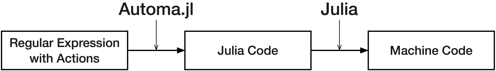

<div v-click>

```julia
fasta_regex = let
    header = re"[a-z]+"
    seqline = re"[ACGT]+"
    record = '>' * header * '\n' * rep1(seqline * '\n')
    rep(record)
end
```

</div>

<div v-click>

```julia
machine = let
    header = onexit!(onenter!(re"[a-z]+", :mark_pos), :header)
    seqline = onexit!(onenter!(re"[ACGT]+", :mark_pos), :seqline)
    record = onexit!(re">" * header * '\n' * rep1(seqline * '\n'), :record)
    compile(rep(record))
end
```

</div>

<div class="flex gap-2 absolute bottom-10 right-8">


</div>

<div class="citation-caption">author: `@bicycle1885`, many improvements: `@jakobnissen` · Repo: https://github.com/BioJulia/Automa.jl</div>

---
class: text-sm
---

# BioMakie.jl enables easy plotting of protein structure

```julia
using BioMakie
using GLMakie
using BioStructures
struc = retrievepdb("2vb1") |> Observable
## or
struc = read("2vb1.pdb", BioStructures.PDB) |> Observable

fig = Figure()
plotstruc!(fig, struc; plottype = :ballandstick, gridposition = (1,1), atomcolors = aquacolors)
plotstruc!(fig, struc; plottype = :covalent, gridposition = (1,2))
```

<div class="flex items-center gap-6 mt-2">
<div class="flex flex-col items-center gap-1">

<span class="text-sm font-mono">@dkool</span>
</div>
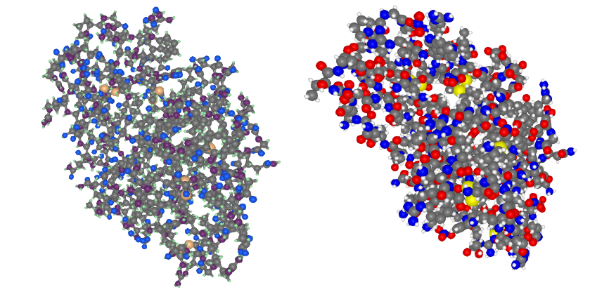
</div>

<div class="citation-caption">author: `@dkool` · Repo: https://github.com/BioJulia/BioMakie.jl</div>

---
layout: two-cols-header
layoutClass: gap-8 items-center
---

# BioMakie.jl enables easy plotting of protein structure

::left::

Viewing the frequencies of amino acids in a multiple sequence alignment


::right::

<div v-click>

Database information can be displayed for a protein (including a GPT response, OpenAI.jl)

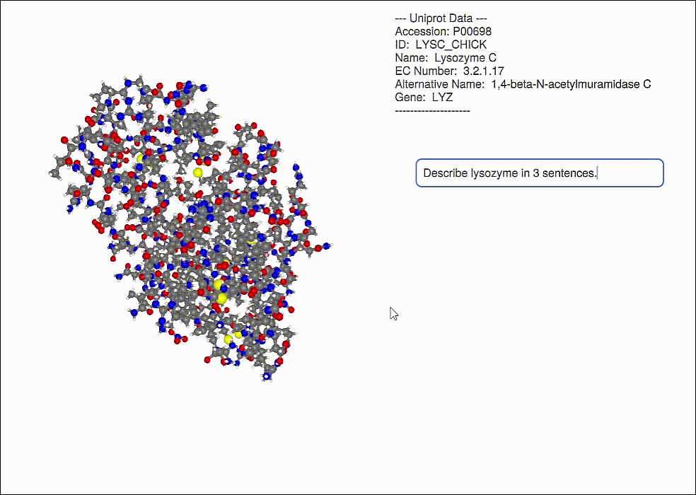

</div>

::bottom::

<div class="citation-caption">Repo: https://github.com/BioJulia/BioMakie.jl</div>

---
layout: center
---

# SingleCellProjections.jl enables fast, memory-efficient scRNAseq

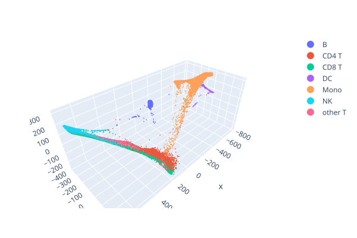

<div class="citation-caption">Repo: https://github.com/BioJulia/SingleCellProjections.jl</div>

---

# SingleCellProjections.jl enables fast, memory-efficient scRNAseq

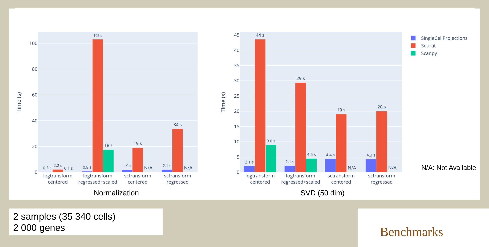

<div class="citation-caption">Repo: https://github.com/BioJulia/SingleCellProjections.jl</div>

---
layout: center
class: text-center
---

<LabLogo size="5rem" class="mx-auto mb-6" />

# Thank you

<div class="text-ink-muted">

Questions? Reach out — [bonhamlab.bio](https://bonhamlab.bio) · dev@bonham.ch

</div>

